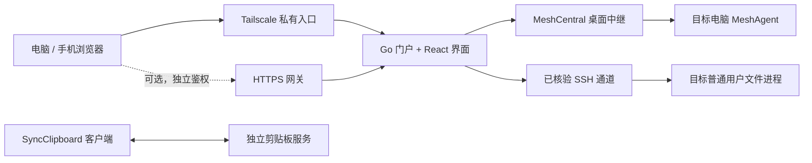

<p align="center">
  
</p>

# Screen Control

**在浏览器中连接自己的电脑，统一处理远程桌面、文件与剪贴板。**

[](https://github.com/J-ChenX/screen_control/actions/workflows/ci.yml)
[](LICENSE)
[](docs/ROADMAP.md)

[使用指南](docs/USAGE.md) · [配置指南](docs/CONFIGURATION.md) · [文档导航](docs/README.md) · [参与贡献](CONTRIBUTING.md) · [安全政策](SECURITY.md)

Screen Control 是一个面向个人登记设备的网页远控项目，以 Tailscale 私有网络为主要入口。当前环境包含四台电脑与一部 Android 手机：电脑可以互相控屏和复制文件，手机作为浏览器控制端使用。门户使用 Go 与 React/TypeScript，桌面通道桥接 MeshCentral，文件操作由目标电脑的普通用户进程执行，剪贴板由独立的 SyncClipboard 服务同步。

> **当前为 G0 实机桥接，尚未完成生产验收。** 正式身份模块、生产会话与租约、独立桌面源站、统一文件数据面及完整 G0/G3 证据门仍有待完成。此仓库适合了解实现、参与开发和按说明配置自有环境；不能直接视作通用多用户远控服务。

## 当前能力

| 能力 | 已有实现 | 边界与限制 |
| --- | --- | --- |
| 设备门户 | 读取 MeshCentral 权威在线状态，识别已登记的来源设备 | 来源基于服务端 Tailscale 节点身份；不能控屏连接自身 |
| 远程桌面 | 真实画面、键鼠输入、画质切换、断线恢复、控屏内文件弹窗 | 恢复不重放旧输入；只有明确“锁屏并结束连接”才请求锁屏，尚无锁屏完成回执 |
| 手机控制 | 点击、拖动、常用按键、文字发送、全屏与缩放平移 | 手机作为控制端，不安装 MeshAgent，也不提供被控手机存储入口 |
| 文件工作区 | 双栏浏览、排序、共享文件夹收藏、上传下载、临时预览、压缩、设备间复制 | 普通用户权限；覆盖与删除须确认；永久删除，无回收站或断点续传 |
| 文件夹传输 | 普通用户进程自动打包、流式转发和隔离解压 | 目标同名目录拒绝合并；受磁盘空间与系统权限约束；未确认结果不报告成功 |
| 剪贴板 | 独立 SyncClipboard 侧车与历史保留补丁 | 非收藏历史按既有 48 小时规则清理；浏览器不承担后台同步 |
| 可选 HTTPS 网关 | 独立设备访问密钥、登录 Cookie、API 与 WebSocket 代理 | 默认关闭，需单独配置；不能直接公开原 G0 入口 |

详细交互、浏览器存储限制和各设备验证范围见[使用指南](docs/USAGE.md)。

## 当前运行链路



该图描述当前桥接链路。设备间文件正文由浏览器逐块转发，目标确认后继续；规划中的端点直传、生产授权链与模块关系见[架构全景](docs/ARCHITECTURE.md)。架构和早期任务文档含历史三机范围，当前能力与限制以本页及使用、配置指南为入口。

## 快速开始

### 只开发与验证

需要 Git、GNU Make、[mise](https://mise.jdx.dev/) 以及 C 编译器。Python、OpenSSL、GnuPG 等宿主工具要求见[测试说明](tests/README.md)与[工具链清单](deploy/releases/current/toolchain.lock.json)。Docker 仅在运行 MeshCentral 尖峰时需要。

```bash
git clone https://github.com/J-ChenX/screen_control.git
cd screen_control
make setup
make doctor
make test
make verify
```

`make setup` 按 `.mise.toml` 与前端锁文件安装固定工具链和依赖。这些开发检查不要求连接真实设备，不会安装或重启线上服务。安装锁定 Chromium 后，可运行六项隔离浏览器回归：

```bash
mise exec -- corepack pnpm --dir web exec playwright install chromium
make test-browser
```

### 连接自有环境

先按[配置指南](docs/CONFIGURATION.md)填写 `.env`，准备已登记的 Tailscale 身份、MeshCentral 桌面账号和普通用户文件通道；示例值不能直接用于部署。

```bash
cp .env.example .env
chmod 600 .env
# 按配置指南填写私有值，并将凭据放入受限文件。
make dev
```

门户入口由 `SCREEN_CONTROL_DEV_ORIGIN` 等现有配置决定。生产构建、统一套件、手机接入与网关安装的完整步骤见[使用指南](docs/USAGE.md)。统一套件绑定回环地址，通过 Tailscale Serve 接入；可选公网访问必须使用独立 HTTPS 网关。

## 代码与文档地图

| 路径 | 职责 |
| --- | --- |
| [`cmd/`](cmd/) | Go 门户与普通用户文件进程入口 |
| [`internal/`](internal/) | 桥接、文件操作、身份适配、协议与门户后端 |
| [`web/`](web/) | React/TypeScript 门户、控屏与文件工作区 |
| [`native/`](native/) | Rust 协议核心和 C ABI；独立 MeshAgent 候选集成 |
| [`deploy/`](deploy/) | 当前桥接、套件、网关与候选构建部署说明 |
| [`ops/`](ops/) | 配置加载、引导、备份、网络保护与验收工具 |
| [`tests/`](tests/README.md) | 运维、原生、浏览器和性能专项 |
| [`docs/`](docs/README.md) | 使用、架构、契约、规划和可追溯证据 |

Rust 已通过独立候选工件接入部分实机，日常 `make build` / `make bundle` 仍构建 Go 与前端，不会构建或安装 Rust MeshAgent。适用范围和内存测量见[使用指南](docs/USAGE.md#rust-的实际接入范围)与[内存评估](docs/performance/MEMORY.md)。

## 质量与协作

CI 覆盖 Linux/Windows Rust 与 Go、Go 兼容版本和 Linux 竞态检查、前端测试/类型检查/构建、六项隔离浏览器回归及 Python 运维检查。徽章显示真实主分支状态；通过 CI 不表示真实设备或生产阶段门已经验收。

提交问题前请查看[支持说明](SUPPORT.md)。欢迎通过 Issue 反馈缺陷或讨论功能，通过 PR 改进代码和文档；具体开发流程见[贡献指南](CONTRIBUTING.md)，交流遵循[行为准则](CODE_OF_CONDUCT.md)。漏洞请使用[私密安全报告](SECURITY.md)，避免在公开 Issue 中附上凭据、屏幕内容或个人文件。

[路线图](docs/ROADMAP.md)说明当前实现与生产规划的边界；[变更记录](CHANGELOG.md)只记录可追溯的已有变化；[仓库维护说明](docs/REPOSITORY.md)记录 GitHub 配置与检查依据。

## 开源协议

本项目自有代码采用 [MIT 协议](LICENSE)，版权归 Nix Jiang 所有。MeshCentral、MeshAgent、SyncClipboard 及其他第三方代码和资源遵循各自许可证；本仓库的 MIT 协议不替代第三方许可义务。
