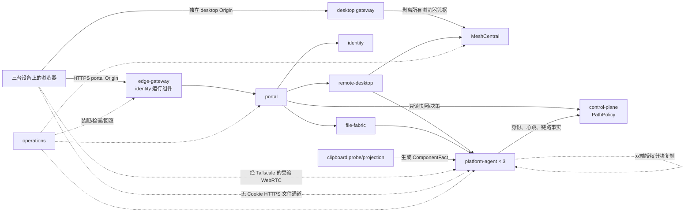

# 私人网页远控 — 架构全景

**最后更新：** 2026-09-03  
**架构层级：** 三层（L1 全局契约 → L2 模块设计 → L3 工作包与文件细节）  
**当前阶段：** 第四阶段；第四阶段全量审查已完成，`IO-01a` bootstrap candidate 通过，当前执行入口为 `IO-01b`

## 项目概述

本项目为用户本人提供一个仅限三台登记 Tailscale 设备访问的网页入口，在 `nix`、`echova` 与 `jiang-chenx` 间统一呈现设备状态、无人值守控屏、普通用户权限文件管理和 SyncClipboard 健康状态。`echova` 是唯一常驻入口与控制平面；屏幕和文件正文优先由端点经 Tailscale 直连。权威范围与验收只在 [A01–A14、QG01–QG03](tasks/private-web-remote/_INDEX.md) 维护；本文件是其架构投影。机器事实见 [环境审计](tasks/private-web-remote/ENVIRONMENT_AUDIT.md)，选型证据见 [技术候选评估](tasks/private-web-remote/TECHNOLOGY_EVALUATION.md)，跨模块安全、可靠性与追踪矩阵见 [全局关注点](appendix/global-concerns.md)。

## 体量与交付分解

项目包含 8 个领域模块、68 个全局唯一工作包和 245 小时主动工程工时；重启、传输、金丝雀及 24 小时观察等墙钟时间独立记录。第三阶段按四条交付流拆分：①[门户与控制平面](tasks/private-web-remote-portal-control/_INDEX.md)；②[远程控屏](tasks/private-web-remote-remote/_INDEX.md)；③[文件数据面](tasks/private-web-remote-files/_INDEX.md)；④[集成与运维](tasks/private-web-remote-integration-ops/_INDEX.md)。每条流再按不超过 8 个工作包的可恢复执行段推进；跨段只引用完整工作包 ID 或正式门。唯一 wire contract、威胁模型和验证工程分别见[协议契约](appendix/protocol-contracts.md)、[威胁模型](appendix/threat-model.md)和[验证工程策略](appendix/verification-strategy.md)。

## 模块地图

实线表示控制调用或状态流，虚线表示大数据路径或运行装配。Portal 与 Desktop/Mesh 必须使用不同 host Origin。`edge-gateway` 是 `identity` 拥有、由 `operations` 独立管理的 Go 进程组件，不是第九个领域模块；它对真实 socket peer 调用 LocalAPI `WhoIsForIP` 并终止 TLS。Desktop gateway 只用 `__Host-mesh-route` 选路，向 Mesh 转发前剥离 Cookie、Authorization、CSRF 与外来身份头；Mesh 返回任意 `Set-Cookie` 即失败关闭。普通用户 agent 不持有 LocalAPI 权限，只能从最小系统身份 `screen-control-peer-helper` 获取绑定真实已接受连接的一次性证明。所有业务网络均在 Tailscale/WireGuard 内，禁止裸公网或未认证 LAN 数据通道。

## 模块清单

| 模块 | 唯一职责 | 内部依赖 | 骨架 | 血肉 | 神经 | 第三阶段文档 |
|---|---|---|---|---|---|---|
| `identity` | 入口网关、来源节点、密码会话、设备登记、派生凭据与统一撤销 | — | ✅ | ✅ | ⬜ | [文档](modules/identity/README.md) |
| `control-plane` | 分项状态、事件、操作租约及统一 `PathPolicy` 权威事实/决策 | `identity` | ✅ | ✅ | ⬜ | [文档](modules/control-plane/README.md) |
| `platform-agent` | 三机代理运行时及 Linux/Windows 锁屏、文件、回收站适配 | `identity`, `control-plane` 契约 | ✅ | ✅ | ⬜ | [文档](modules/platform-agent/README.md) |
| `remote-desktop` | desktop-only 内核隔离、会话生命周期和锁屏确认 | `identity`, `control-plane`, `platform-agent` | ✅ | ✅ | ⬜ | [文档](modules/remote-desktop/README.md) |
| `file-fabric` | 文件命名空间、安全操作、审计、续传和跨设备复制 | `identity`, `control-plane`, `platform-agent` | ✅ | ✅ | ⬜ | [文档](modules/file-fabric/README.md) |
| `clipboard` | SyncClipboard 私网迁移、三项健康及 Ubuntu 快捷键漂移检测 | `control-plane`, `platform-agent` | ✅ | ✅ | ⬜ | [文档](modules/clipboard.md) |
| `portal` | 唯一 UI 和跨领域状态呈现，不复制授权或领域规则 | `identity`, `control-plane`, `remote-desktop`, `file-fabric`, `clipboard` | ✅ | ✅ | ⬜ | [文档](modules/portal/README.md) |
| `operations` | 部署、秘密、版本、备份回滚、容量和验收编排 | 全部模块 | ✅ | ✅ | 🔄 | [文档](modules/operations/README.md) |

状态：⬜ 待开始 | 🔄 进行中 | ✅ 已完成。骨架完成只表示边界和契约已定义，不表示代码存在。

## L1 跨模块接口契约

本节只投影所有权；v1 envelope、字段、route、HTTP/错误映射、权限、幂等、cursor、异步 Operation、deadline tree 和兼容规则只在[协议契约](appendix/protocol-contracts.md)定义并生成测试，调用方不得复制或扩写第二份 wire schema。

| 所有者 | 契约签名（语义级） | 消费者 | 失败原则 |
|---|---|---|---|
| `identity` | Login/Logout/ChangePassword；登记与 bootstrap；签发/撤销派生凭据；离线验证 control-plane 签名 `LeaseAssertion` | 所有入口与代理 | 节点、登记、会话、租约或派生链任一无效即拒绝；identity 不回调 control-plane |
| `control-plane` | Agent-only `ReportStatus`；consumer-only Snapshot/Events/`ReadPathDecision`；Lease Create/Renew/Release | 代理及各领域 | 消费者不能提交 facts/now；返回 `factsVersion`；未知或陈旧路径只返回 offline |
| `platform-agent` | Lock；SafeFS object/Trash/Commit；`PeerBindingProof` 复核 | 远控、文件、剪贴板 | 结果未知不报成功；文件基于已打开句柄且永不提权；helper 不可用即失败关闭 |
| `remote-desktop` | Desktop Start/Get/End/LockExit/Evidence + 完整 `DesktopBinding` | `portal` | 每个 HTTP/iframe/WS/输入入口重验归属；撤销终止真实通道；长操作 3 s 内返回 202 |
| `file-fabric` | Entries/Search/Mutations/PermanentDelete；Transfer Query/Resume/AckRange/Abort/Result/Commit | `portal`、端点代理 | `ItemResult` 显式 partial/effects；跨机仅复制；中心 intent 后才允许端点 effect |
| `clipboard` | 三项健康 projection，经 control-plane snapshot/events 对外 | `control-plane` | 单一事实版本；事件/快捷键只作诊断，不替代“服务可达” |
| `portal` | `ServeApp(principal)`；`RenderRoute(route,domainState)` | 浏览器 | 只编排 UI；授权和业务规则由领域 API 复核 |
| `operations` | `Deploy`；`Backup`；`Rollback`；`Verify(acceptanceIds[])` | 运维/验收 | 失败保留上一版本；不得跳过备份、健康检查或隔离目录 |

写操作重试按主体、route、幂等键和请求摘要返回先前结果，不重复 effect；不确定结果只能查询/协调。协议采用显式版本；兼容窗口、超时/重试和故障语义见[协议契约](appendix/protocol-contracts.md)与[全局关注点](appendix/global-concerns.md)。

## 构建顺序与最早验证门

0. **第四阶段起点 `IO-01a`–`IO-01d` + `IO-04a`** — 三机只读 preflight → toolchain/仓库骨架 → 唯一验证入口/CI/证据仓 → 网络 watchdog/救援/自动回滚演练，并建立后续 migration 使用的备份/隔离恢复基线。`IO-01d` 未通过前禁止系统级网络规则实验。
1. **远控候选淘汰门 G0** — 唯一四门为：三平台登录前/安全桌面、Tailscale-only fail-closed、desktop-only、独立 Origin + 无 URL 启动交换；精确绑定八个 `RD-01*` 包。六条完整旅程、输入/显示和 A07 统计属于 G3。
2. **`identity` + G1** — 完成入口、bootstrap/登记、登录/退出/改密、双重身份和持久撤销链；通过 A01–A02。
3. **代理/控制面基础 + G2** — 依次完成 `PA-01`、`PC-04`–`PC-06` 及 `PA-02`–`PA-04`：状态摄入/快照/租约/唯一 `PathPolicy` 与最小 peer helper；消费者只读决策。
4. **UI 与领域前置** — 完成 `PC-07`/`PC-08`、`RD-02`、`FF-00`–`FF-04a`，再以这些稳定 provider 完成 `PC-09`；不得把 Portal 集成放在其消费者之后。
5. **G3 与 G4** — `RD-03a`–`RD-03f` 完成远控 A03–A07/N01–N03/N05；`FF-04b`、`FF-05a`–`FF-05d` 完成文件 A08–A12/N04。两流可按 DAG 并行，N04 不由远控证据替代。
6. **Clipboard + G5** — 按无回跳的 IO 执行段完成逐设备 mTLS、三项健康、Portal 集成、三端传播/24 小时观察和 `IO-02h` 旧公网凭据/入口退役。
7. **生产收口 G6** — 固化版本，按兼容 DAG 部署/回滚，复核 `IO-02h` 已清理的 cpolar/旧凭据/多余监听未回归，并通过 A14、N01–N05、SG01–SG06、QG01–QG03。

完整“需求 → 责任模块 → 依赖 → 最早门 → 证据”矩阵见 [全局关注点 §7](appendix/global-concerns.md)。任何工作包完成时同步模块文档；跨模块依赖变化触发架构修改流程。

## 全局技术选型

| 类别 | 选型 | 生命周期与硬约束 |
|---|---|---|
| 自研后端/代理 | Go 1.26.8 生产基线；CI 验证 1.27.1 | 两者均受支持，生产采用更成熟补丁线；升级须过三机矩阵 |
| Web | React 19.2.8 + TypeScript；Node.js 24.20.0 LTS 仅构建 | 锁文件/镜像摘要固定；不用 RSC 与 `react-server-dom-*`；静态产物由 Go 服务交付 |
| 元数据 | `mattn/go-sqlite3` v1.14.50（内嵌 SQLite 3.53.4），WAL，后端组合根单写 | 仅服务端 CGO 构建；禁用系统 SQLite 链接；启动断言底层版本并执行备份/恢复门 |
| 私网入口 | Tailscale 1.102.3 基线、同版 Go module、Grants + 第一方 Go `edge-gateway` | 使用 `WhoIsForIP` 的目的地址收窄能力与 `Client.GetCertificate`；不信转发头 |
| 密码/会话 | Argon2id + 服务端不透明令牌摘要 | 参数实机定标并限制并发；7 天绝对到期和持久撤销代次 |
| 远控 | MeshCentral server 1.2.5 + 各平台 MeshAgent 构建哈希，Node.js 24.20.0 LTS 容器 | 仅为 G0 尖峰候选；Agent 禁自动升级并金丝雀发布；不得裸 LAN/公网 ICE 或 URL 登录令牌 |
| 剪贴板 | SyncClipboard 3.2.0 目标基线 | 3.1.5 仅作迁移源；三端一致升级、回滚及 A13 通过后转正 |
| 部署 | `echova` Docker Engine 29.7.2/Compose + 三机原生 systemd/Windows Service | 镜像摘要固定；网关、协调器、桌面/文件代理可独立重启；分身份、分秘密 |

候选比较、官方依据和替换触发条件只在 [技术候选评估](tasks/private-web-remote/TECHNOLOGY_EVALUATION.md) 维护。

## 工程原则与阶段状态

| 原则 | 落地与验证 |
|---|---|
| 整洁 | 单一所有者/组合根；迁移项有负责人、备份、证据和删除门；以 QG01 与入口/依赖扫描验证 |
| 现代可持续 | 受支持版本、官方依据、兼容窗口、三机实测、升级与替换门；以 QG02 验证 |
| 可扩展复用 | 身份、租约、选路、路径安全、传输和健康共享版本化契约；以 QG03 与多调用方契约测试验证 |

- [x] 三层策略与 8 个 L1 模块完成。
- [x] 多专家增强自审完成；可在文档内闭合的准确性、安全性和整洁性问题均已修正，记录见 [review-log](tasks/private-web-remote/review-log.md)。
- [x] 用户已批准从有条件架构进入血肉阶段。
- [x] 8 个模块血肉文档、具体预算、接口签名与安全边界完成。
- [x] 68 个全局唯一工作包已拆入 4 条交付流和不超过 8 包的可恢复执行段；每包 2–4 小时主动工时，跨流依赖可解析。
- [x] 第三阶段文档预审完成；模块入口、视角文件、工作包和本地链接检查通过。
- [x] 中期多专家审核完成；总体状态为“不通过第三阶段门控（架构方向保留）”，见 [review-log](tasks/private-web-remote/review-log.md)。
- [x] 中期审核中的 G0 范围、依赖/契约、文件一致性、安全根信任与验证工程阻断已整改。
- [x] 第三阶段独立架构/安全/质量复审无阻断，已批准进入第四阶段。
- [x] `IO-01a` 的 hash 固定只读 recorder、三机固定白名单、语义校验、脱敏摘要、追加式 run 和防篡改封存已实现；15 项 bootstrap 测试通过。
- [x] `IO-01a` bootstrap candidate：三机必填类别、UTC ≤2 s 与同步健康均通过，bundle 的完整性、provenance、当前 recorder 匹配和受信状态已复核；正式证据仍由 `IO-01c` 导入重验后签发。
- [ ] G0 实证 Mesh WebRTC 的 Tailscale-only 网络强制，以及不经 URL 的单次启动交换；失败则重新选型。
- [ ] 第四阶段当前执行 `IO-01b`；`IO-01a`–`IO-01d` 通过后才运行 G0，G0 通过后才进入依赖远控内核的全面实现。
